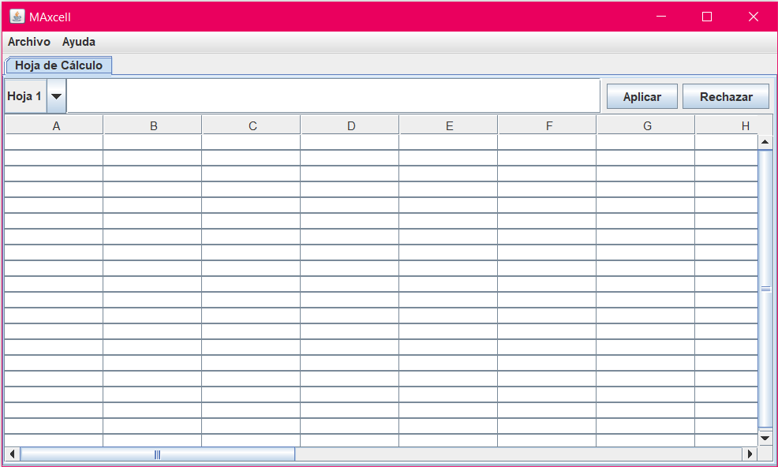
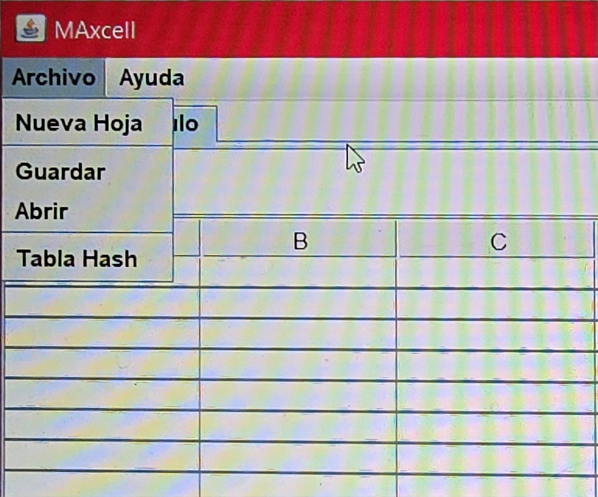
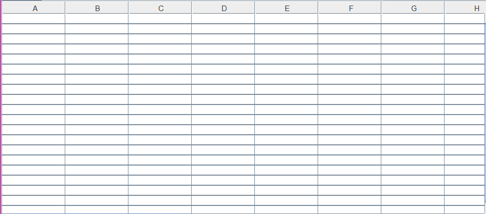
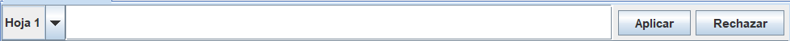
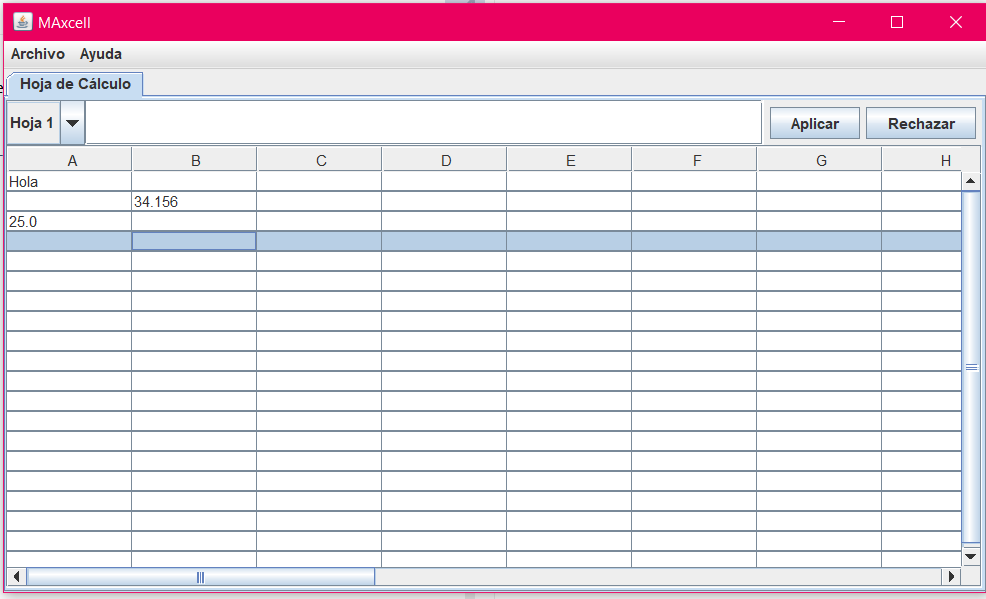

# Manual de Usuario – Hoja de Cálculo

## Índice
1. [Introducción](#1-introducción)  
2. [Requisitos del sistema](#2-requisitos-del-sistema)  
3. [Instalación y ejecución del programa](#3-instalación-y-ejecución-del-programa)  
4. [Interfaz del sistema](#4-interfaz-del-sistema)  
   - [4.1 Menú Archivo](#41-menú-archivo)  
   - [4.2 Área de trabajo y celdas](#42-área-de-trabajo-y-celdas)  
   - [4.3 Caja de fórmulas y botones](#43-caja-de-fórmulas-y-botones)  
5. [Uso del sistema](#5-uso-del-sistema)  
   - [5.1 Ingreso de datos](#51-ingreso-de-datos)  
   - [5.2 Aplicación de fórmulas](#52-aplicación-de-fórmulas)  
     - [5.2.1 Fórmulas entre dos celdas](#521-fórmulas-entre-dos-celdas)  
     - [5.2.2 Fórmulas con rangos](#522-fórmulas-con-rangos)  
   - [5.3 Guardar y abrir libros](#53-guardar-y-abrir-libros)  
   - [5.4 Crear nueva hoja](#54-crear-nueva-hoja)  
   - [5.5 Tabla Hash](#55-tabla-hash)  
6. [Recomendaciones de uso](#6-recomendaciones-de-uso)  
7. [Preguntas frecuentes (FAQ)](#7-preguntas-frecuentes-faq)  
---

## 1. Introducción

Este manual de usuario está diseñado para guiarte en el uso del sistema de hoja de cálculo desarrollado como proyecto final del curso **Programación III**.

El sistema simula una hoja de cálculo con funcionalidades básicas como ingreso de datos, operaciones matemáticas (suma y multiplicación), múltiples hojas, almacenamiento de libros y una tabla hash con manejo de colisiones.

---

## 2. Requisitos del sistema

- **Sistema operativo:** Windows 10 o superior / Linux / macOS  
- **Java Development Kit:** JDK 17  
- **RAM recomendada:** 2 GB o más  
- **Dependencias externas:** Ninguna  
- **Modo de ejecución:** Desde entorno como IntelliJ, NetBeans.

---

## 3. Instalación y ejecución del programa

1. Instala el **JDK 17**.
2. Clona o descarga el proyecto.
3. Abre el proyecto en tu IDE preferido.
4. Compila todos los archivos `.java`.
5. Ejecuta la clase principal (`App.java`).



---

## 4. Interfaz del sistema

### 4.1 Menú Archivo

Contiene las opciones:

- **Abrir:** Carga un libro guardado.
- **Guardar:** Guarda el libro actual.
- **Nueva Hoja:** Añade una hoja nueva al libro.
- **Tabla Hash:** Abre la ventana de la tabla hash.



---

### 4.2 Área de trabajo y celdas

La tabla central representa una hoja de cálculo con celdas que pueden contener:

- Texto
- Números
- Valores vacíos



---

### 4.3 Caja de fórmulas y botones

Arriba se encuentra:

- **Caja de texto** para fórmulas
- Botones:
  - `Aplicar`: Ejecuta la fórmula
  - `Rechazar`: Cancela

También puedes escribir directamente en la celda y pulsar **Enter**.



---

## 5. Uso del sistema

### 5.1 Ingreso de datos

En cada celda puedes ingresar:

- Texto: `"Hola mundo"`
- Números: `25`, `3.14`
- Dejarla vacía



---

### 5.2 Aplicación de fórmulas

Las fórmulas inician con `=` y permiten realizar:

- Sumas
- Multiplicaciones

#### 5.2.1 Fórmulas entre dos celdas

```plaintext
=suma((1,1),(2,2))
=multi((1,1),(2,2))
=multiplicacion((1,1),(2,2))
```

#### 5.2.1 Fórmulas con rangos
```plaintext
=suma(Hoja 1, (1,1), (5,2))
=multi(Hoja 1, (1,1), (5,2))
=multiplicacion(Hoja 1, (1,1), (5,2))
```

### 5.3 Guardar y abrir libros
* Guardar libro: En el menú Archivo > Guardar, se guarda el estado actual de todas las hojas.
* Abrir libro: En Archivo > Abrir, puedes cargar un archivo guardado anteriormente.

***El sistema guarda los archivos SIN extensión.***

## 6. Recomendaciones de uso

- Verifica siempre que la celda esté seleccionada antes de aplicar una fórmula desde la caja de texto.
- Si modificas valores en celdas que participan en una fórmula, recuerda volver a ingresarla y aplicar de nuevo para obtener resultados actualizados.
- Usa nombres significativos al crear nuevas hojas para mantener tu libro organizado.
- Evita ingresar caracteres especiales innecesarios en las fórmulas o claves para la tabla hash.
- Guarda frecuentemente tu trabajo utilizando la opción "Guardar" para evitar pérdida de datos.
- Al trabajar con la tabla hash, ten en cuenta que su capacidad es limitada (10 posiciones). Si insertas muchas claves con el mismo hash, podrías llegar al límite de intentos por colisión.

## 7. Preguntas frecuentes (FAQ)

* **¿Por qué no se actualiza el resultado cuando cambio los valores de las celdas usadas en una fórmula?** *
Esto ocurre porque el sistema no tiene un mecanismo automático de actualización. Debes volver a escribir o aplicar la fórmula manualmente.
* **¿Puedo escribir la fórmula directamente en una celda?** *
Sí. Puedes escribirla directamente y luego presionar Enter. Alternativamente, puedes usar la caja de texto de fórmula y hacer clic en "Aplicar".
* **¿Qué pasa si intento aplicar una fórmula en una celda vacía?** *
La celda mostrará un error o resultado incorrecto. Asegúrate de que las celdas usadas tengan valores válidos (números).
* **¿Qué tipo de datos puedo ingresar en la tabla hash?** *
Puedes ingresar texto o números como claves. El sistema calculará el hash correspondiente y lo insertará en la tabla.
* **¿Puedo guardar varias hojas en el mismo archivo?** *
Sí. Al guardar el libro, todas las hojas activas y sus contenidos se almacenan en el archivo generado.
